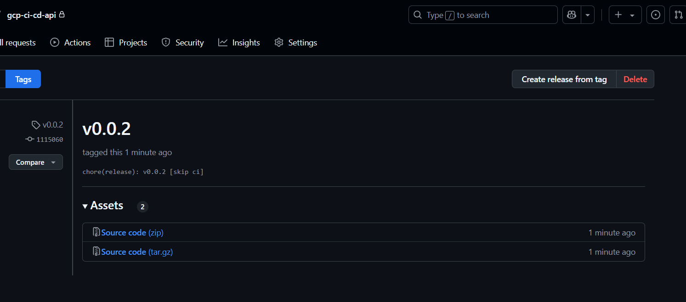

# Rapport de Déploiement – Infrastructure GCP & CI/CD

## 1. Architecture de l'infrastructure

### Choix du provider : Google Cloud Platform (GCP)

Choix de Google Cloud Platform pour les raisons suivantes :
- Facilité d'intégration avec des outils d'automatisation tels que Terraform et Ansible.
- Offre gratuite adaptée aux environnements de test via les VM `e2-micro`.
- Fiabilité et scalabilité des services.
- Documentation et support communautaire solides.

### Architecture déployée

L’infrastructure repose sur les éléments suivants :
- **1 réseau VPC personnalisé** nommé `terraform-network`.
- **1 règle de pare-feu** permettant l'accès aux ports 22 (SSH), 3000 et 8080.
- **1 machine virtuelle (VM)** Debian 11 de type `e2-micro` :
  - Accessible via SSH (clé publique fournie).
  - Provisionnée automatiquement avec un script d’installation de base (`apt update`, `git`).

Les variables (projet, région, zone) sont externalisées et injectées via GitHub Actions.

---

## 2. Configuration Terraform

### Structure

Le répertoire `infra/` contient le code Terraform avec :
- Déclaration du provider `google` et authentification via `credentials.json`.
- Déploiement d’un VPC, d’un firewall, et d’une instance GCP.

### Points clés
- Les clés SSH sont injectées dynamiquement dans les métadonnées de l’instance.
- L’exécution est automatisée via GitHub Actions (voir plus bas).
- Le state Terraform est conservé dans le repo, avec mécanisme de cache.

---

## 3. Configuration Ansible

Le playbook `ansible/deploy.yml` permet de :
- Installer NVM et Node.js 22.14.0.
- Cloner le dépôt de l’API depuis GitHub via un token `GH_PAT`.
- Installer les dépendances avec `npm install --production`.
- Lancer l’application via PM2 (`index.js`) sous le nom `my-api`.

L'accès SSH est géré automatiquement via `webfactory/ssh-agent` et une clé privée injectée.

---

## 4. Pipeline CI/CD (GitHub Actions)

### Déclenchement

Le workflow est exécuté à chaque **push sur la branche `main`**.

### Étapes principales

1. **Initialisation**
   - Récupération du code (`actions/checkout`).
   - Configuration des variables d’environnement.
   - Authentification Google Cloud avec `google-github-actions/auth`.

2. **Terraform**
   - Création du fichier `credentials.json`.
   - Création de l’infrastructure avec `terraform apply`.

3. **Récupération de l’IP**
   - Extraction de l’adresse IP publique de la VM via `terraform output`.

4. **Provisioning avec Ansible**
   - Installation de dépendances.
   - Connexion à la VM via SSH.
   - Exécution du playbook pour déployer et démarrer l'API.

5. **Publication**
   - Configuration de Git (`CI Bot`) pour pousser les tags et CHANGELOG générés par `release.sh`.

### Variables sensibles (secrets utilisés)
- `GCP_SA_KEY` : Clé de compte de service Google.
- `GCP_PROJECT_ID`, `GOOGLE_REGION`, `GOOGLE_ZONE` : Identifiants projet et zone GCP.
- `SSH_PRIVATE_KEY`, `SSH_PUBLIC_KEY` : Clés SSH pour accéder à la VM.
- `GH_PAT` : Token personnel GitHub utilisé pour le clone privé du repo.

---

## 5. Difficultés rencontrées

### 5.1 Problème de `terraform.tfstate` dans GitHub Actions

Lors des premières exécutions, Terraform ne disposait pas du fichier `terraform.tfstate`, ce qui empêchait le suivi correct de l’infrastructure.

**Solution :** mise en place d’un système de cache avec `actions/cache@v3` pour stocker le `terraform.tfstate`.

```yaml
- name: Restore Terraform state from cache
  uses: actions/cache@v3
  with:
    path: infra/terraform.tfstate
    key: terraform-state-${{ github.ref }}
```

### 5.2 Mauvaise version de Node.js avec Ansible

Initialement, la commande `apt install nodejs` installait une version trop ancienne (`12.x.x`), incompatible avec notre API.

**Solution :** installation de **NVM** pour une gestion précise de la version de Node.js via Ansible :

```yaml
- name: Download and install NVM
  shell: |
    export PROFILE=/home/debian/.bashrc
    curl -o- https://raw.githubusercontent.com/nvm-sh/nvm/v0.40.3/install.sh | bash
```

---

**Ansible playbook**
```bash
ok: [X.X.X.X]

TASK [Install dependencies] ****************************************************
ok: [X.X.X.X]

TASK [Download and install NVM] ************************************************
ok: [X.X.X.X]

TASK [Load NVM and install Node.js] ********************************************
changed: [X.X.X.X]

TASK [Check Node.js version] ***************************************************
ok: [X.X.X.X]

TASK [Clone the repository] ****************************************************
changed: [X.X.X.X]

TASK [Ensure the app root directory exists] ************************************
changed: [X.X.X.X]

TASK [Install npm dependencies] ************************************************
changed: [X.X.X.X]

TASK [Start app with PM2] ******************************************************
changed: [X.X.X.X]

PLAY RECAP *********************************************************************
X.X.X.X            : ok=9    changed=5    unreachable=0    failed=0    skipped=0    rescued=0    ignored=0  
```

**Terraform Apply output**


**Génération d'une clé SSH**


**Realea script (Tag & Changelog)**



**Commits**


**Pipeline**


**GET API endpoint**

